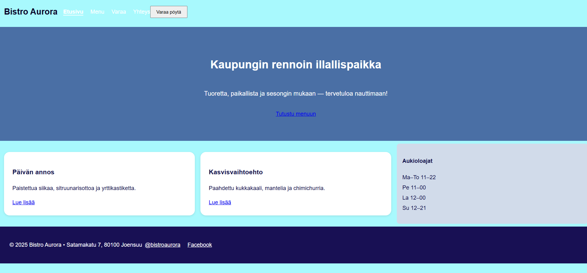

# Bistro Aurora 

## Missä käytetty Sass

- **Muuttujat (`_variables.scss`)**  
  Värit, typografia ja spacing, esimerkiksi `$primary-color`, `$font-size`, `$spacer`.

- **Mixinit (`_mixins.scss`)**  
  `mixin ja `@include` käytetty napille (`.btn`) ja containerille (`.container`).

- **Funktiot**  
  `darken()` ja `lighten()` käytetty esim. sidebarille ja footerille väriensäätöihin.

- **@import**  
  `style.scss` sisälle lisätty `_variables.scss`, `_mixins.scss` ja `_layout.scss`.

- **Sisäkkäiset elementit**  
  Esim. `body` ja `h1` sisäkkäin `_layout.scss`:ssä.

  
